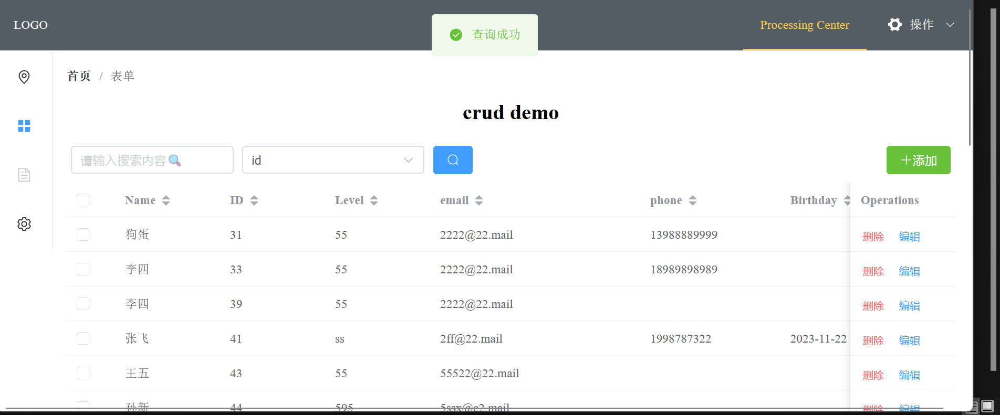
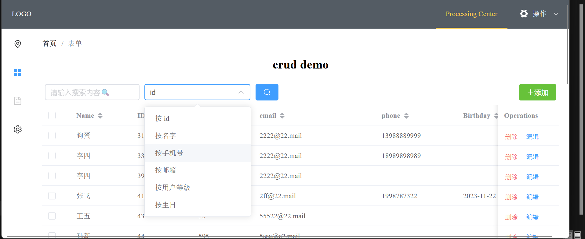
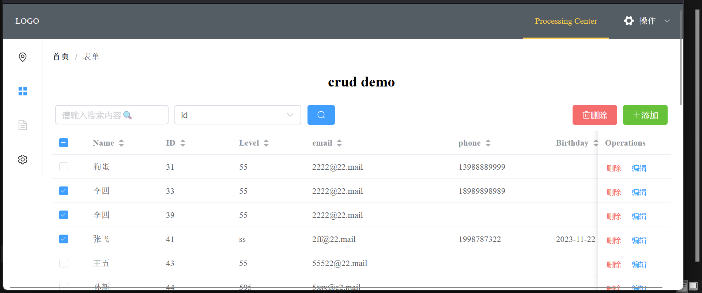
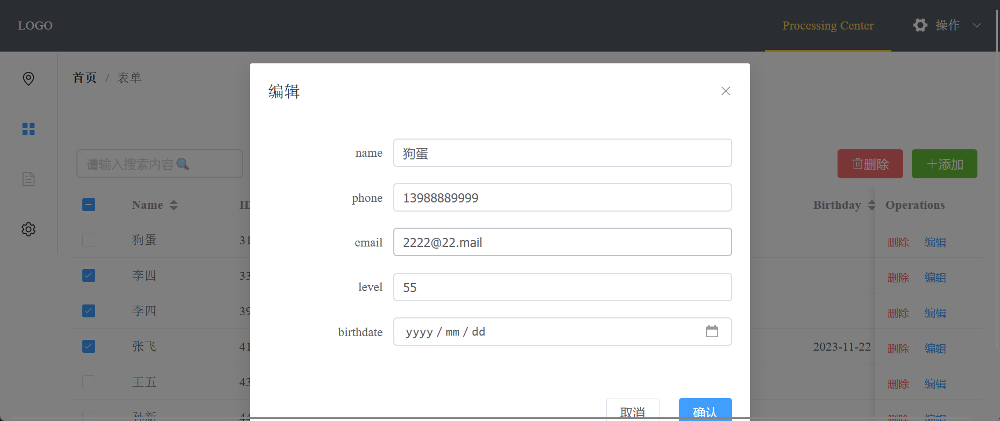
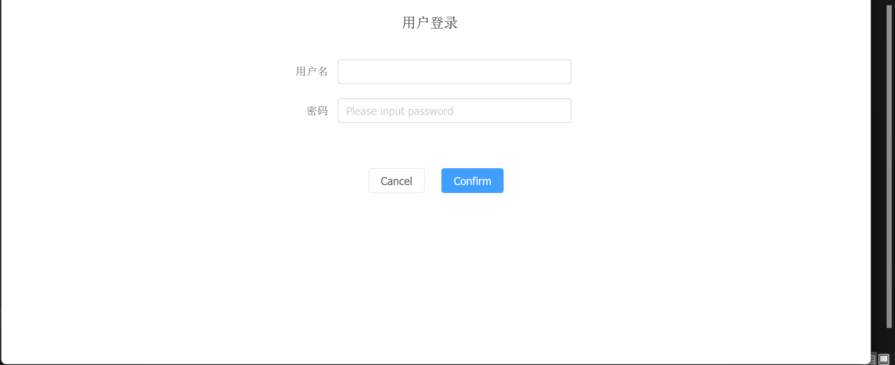
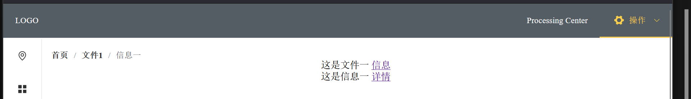

# vue-crud-template

✨基于和 vue3, axios 和 Go, gorm, gin 和 MySQL  的简单信息管理系统模板✨📌含完整前后端：信息管理系统模板，后台管理系统模板，数据库管理系统模板。实现对数据库最基本的增删改查（CRUD）。📌前后端分离

📌[配套后端项目地址](https://github.com/bytesc/go-crud-template)

[个人网站：www.bytesc.top](http://www.bytesc.top) 

[个人博客：blog.bytesc.top](http://blog.bytesc.top)

🔔 如有项目相关问题，欢迎在本项目提出`issue`，我一般会在 24 小时内回复。

## 效果展示




完善的查询



多选删除



编辑行



全局遮罩的登录界面



面包屑导航




## 项目运行方法

### 前端运行环境

- node.js `npm -v 9.5.0`
- vue3 `@vue/cli 5.0.8`


### 安装依赖
```bash
npm install

# npm run dev
# npm install -D unplugin-vue-components unplugin-auto-import

# npm install element-plus
# npm install @element-plus/icons-vue

# npm install vue-router@4
# npm install vuex@next --save
# npm install axios
```

### 运行项目
```bash
npm run dev
```

### 运行端口
`vite.config.js`
```js
export default defineConfig({
  plugins: [vue()],
  server:{
    port : 8086, //指定部署端口号
    proxy:{
      "/api":{  //代理解决跨域
        target:"http://127.0.0.1:8088/"
      }
    }
  },
  base: "./" //打包相对路径
})
```
- `port` 为前端的运行端口
- `target` 后端服务器 url

如果希望显示数据，需要用到配套的后端项目📌[配套后端项目地址](https://github.com/bytesc/go-crud-template)

### 项目打包

`vite.config.js` 配置打包相对路径(`./`)和指定部署端口号
```bash
npm run build
```
在`/dist/`文件夹下会有`index.html`.

如果本地打开需要用firefox，或是webstorm，vscode的Live Server插件等。crome内核的浏览器（google，edge）会出现无法访问本地文件的问题（不影响线上部署，线上部署后任何浏览器都可以打开的）。


### 官方文档

- [vue3](https://cn.vuejs.org/guide/quick-start.html)
- [vite](https://cn.vitejs.dev/guide/)

- [vue-router](https://router.vuejs.org/zh/)
- [axios](https://www.axios-http.cn/docs/intro)
- [vuex](https://vuex.vuejs.org/zh/guide/)

- [element-plus](https://element-plus.org/zh-CN/)


# 开源许可证

此翻译版本仅供参考，以 LICENSE 文件中的英文版本为准

MIT 开源许可证：

版权所有 (c) 2023 bytesc

特此授权，免费向任何获得本软件及相关文档文件（以下简称“软件”）副本的人提供使用、复制、修改、合并、出版、发行、再许可和/或销售软件的权利，但须遵守以下条件：

上述版权声明和本许可声明应包含在所有副本或实质性部分中。

本软件按“原样”提供，不作任何明示或暗示的保证，包括但不限于适销性、特定用途适用性和非侵权性。在任何情况下，作者或版权持有人均不对因使用本软件而产生的任何索赔、损害或其他责任负责，无论是在合同、侵权或其他方面。